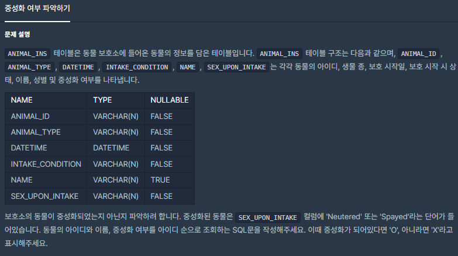
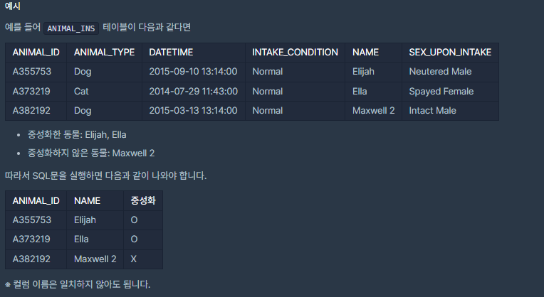

# [[SQL] 중성화 여부 파악하기](https://programmers.co.kr/learn/courses/30/lessons/59409)



___
## 🤔접근
___
## 💡풀이
- 특정 컬럼에 어떠한 값이 있는지 확인하려면 `IF` 구문을 이용하자.
	```sql
	IF(컬럼 LIKE '%값%', '값이 존재하면 표시할 값', '값이 없으면 표시할 값')
	```
	- SEX_UPON_INTAKE 컬럼에 'Neutered'라는 단어가 들어 있는지 확인하고, 있다면 `O`, 없다면 `X`를 출력하는 컬럼을 만들면 다음과 같다.
		```sql
		IF(SEX_UPON_INTAKE LIKE '%Neutered%', 'O', 'X')
		```
	- 'Spayed'라는 단어가 들어 있는지도 체크해야 하므로, 추가하면 다음과 같다.
		```sql
		IF(SEX_UPON_INTAKE LIKE '%Neutered%', 'O', 'X' OR SEX_UPON_INTAKE LIKE '%Spayed%', 'O', 'X')
		```
	- 또한, 해당 컬럼명을 '중성화'로 바꾸려면 다음과 같이 추가하자.
		```sql
		IF(SEX_UPON_INTAKE LIKE '%Neutered%', 'O', 'X' OR SEX_UPON_INTAKE LIKE '%Spayed%', 'O', 'X') AS '중성화'
		```
___
## ✍ 피드백
___
## 💻 핵심 코드
```sql
SELECT ANIMAL_ID, NAME, 
IF(SEX_UPON_INTAKE LIKE '%Neutered%' OR SEX_UPON_INTAKE LIKE '%Spayed%', 'O', 'X') AS '중성화' 
FROM ANIMAL_INS 
ORDER BY ANIMAL_ID
```