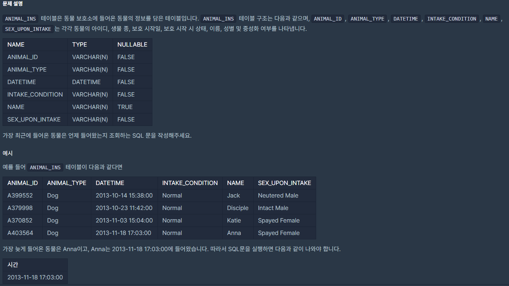

## [[SQL] 최댓값 구하기](https://programmers.co.kr/learn/courses/30/lessons/59415)
<br>
<br>
___

## 풀이
Aggregate Function(집계 함수) 를 이용하여 select 문에서 해당 attribute 에 대한 결과를 얻을 수있다. 
___
```sql
select max(DATETIME) from ANIMAL_INS
```

