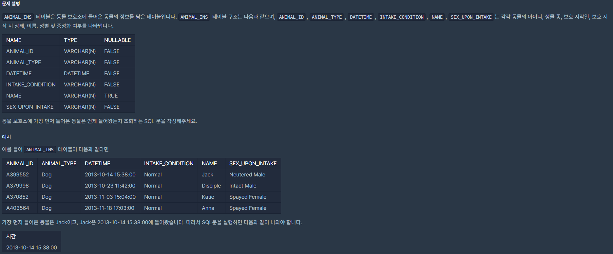

## [[SQL] 최솟값 구하기](https://programmers.co.kr/learn/courses/30/lessons/59038(%EC%B5%9C%EC%86%9F%EA%B0%92)

___

## 💡 풀이
- select 문에서 max 또는 min 함수를 사용하여 최댓/최솟값을 구할 수 있다.
___
```sql
select min(DATETIME) from ANIMAL_INS 
```